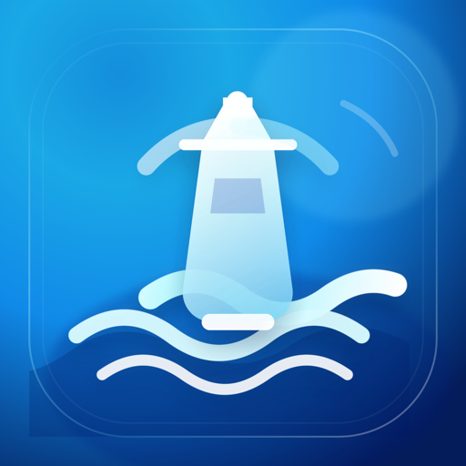

<p align="center">
  
</p>

# Lightship

Lightship is a focused Kubernetes desktop client built with Electron, React, and TypeScript. It
keeps day-to-day cluster work in a compact, keyboard-friendly interface while using the
credentials and permissions from your existing kubeconfig.

## Highlights

- Connect to multiple clusters from `~/.kube/config` or a pasted kubeconfig.
- Browse pods, nodes, namespaces, workloads, networking, configuration, storage, RBAC, Helm
  releases, and custom resources.
- Inspect resource properties, events, YAML, logs, and container terminals.
- Create resources from YAML; edit manifests, ConfigMaps, and Secrets; scale or restart workloads;
  and manage namespaces and nodes.
- Run local port forwards and follow live Kubernetes watches.
- Review, filter, export, and clear a local activity history of mutations.
- Use light, dark, or system themes.

## Requirements

- macOS, Windows, or Linux
- Node.js `^20.19.0` or `>=22.12.0`
- [pnpm](https://pnpm.io/)
- Access to a Kubernetes cluster through a kubeconfig
- An available OS credential store so Electron can encrypt saved kubeconfigs
- `kubectl` on `PATH` when using pod-exec terminals

The application talks to Kubernetes through `@kubernetes/client-node`; most features do not need
the `kubectl` or Helm command-line tools. Helm release data is read from the cluster's Helm secrets.

## Quick start

```bash
git clone https://github.com/pintlehq/lightship.git
cd lightship
pnpm install
pnpm dev
```

On first launch, select **Add cluster** and choose contexts detected in `~/.kube/config`, or paste a
kubeconfig and select the contexts to import. Use **Manage clusters** to test the saved connection.

Lightship does not currently publish a production download channel. See
[Getting started](docs/getting-started.md) for source builds and platform packaging commands.

## Documentation

| Guide                                      | Description                                                               |
| ------------------------------------------ | ------------------------------------------------------------------------- |
| [Getting started](docs/getting-started.md) | Install, run, connect a cluster, and package the app.                     |
| [User guide](docs/user-guide.md)           | Navigate clusters and use Lightship's Kubernetes workflows.               |
| [Architecture](docs/architecture.md)       | Understand process boundaries, data flow, and persistence.                |
| [Development](docs/development.md)         | Follow the repository workflow, conventions, and test strategy.           |
| [Security](docs/security.md)               | Review credential handling, local data, permissions, and safety controls. |

The [documentation index](docs/README.md) provides a suggested reading path.

## Development commands

```bash
pnpm typecheck
pnpm test
pnpm lint
pnpm build
pnpm test:e2e
pnpm build:unpack
```

Lightship separates the privileged Electron main process from the browser-safe React renderer with
a narrow, validated preload API. Read the [architecture guide](docs/architecture.md) before adding
cross-process behavior and the [engineering handbook](AGENTS.md) before contributing.

## Security

Saved kubeconfigs are reduced to one context per cluster and encrypted with Electron
`safeStorage`. Lightship refuses to persist credentials when secure OS storage is unavailable.
Mutating operations use the permissions in the selected kubeconfig and require confirmation in the
UI where they are destructive or disruptive. See the [security guide](docs/security.md) for details.

## License

Lightship is licensed under the [Functional Source License 1.1, ALv2 Future License](LICENSE)
(`FSL-1.1-ALv2`). Each released version converts to the Apache License 2.0 on the second anniversary
of its release date, as described in the license text.
