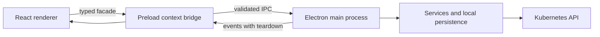

# Architecture

Lightship follows Electron process boundaries so Kubernetes credentials and privileged operations
never become direct renderer dependencies.

## Process boundaries

### Main process

`src/main` owns Electron integration and every privileged operation: encrypted credential storage,
Kubernetes clients, resource reads and mutations, logs, watches, terminals, port forwarding, Helm
release decoding, and local activity or UI-state files. IPC handlers parse renderer arguments
before calling services and validate results before returning them.

### Preload bridge

`src/preload` exposes the narrow `window.api` surface through Electron's context bridge. It maps
typed invocations and streaming subscriptions without exposing `ipcRenderer` or Node.js primitives
to application code. Subscription helpers attach event listeners before starting work and return a
deterministic stop function.

### Shared contracts

`src/shared/ipc-types.ts` contains Zod schemas for data crossing the process boundary and derives
TypeScript types from those schemas. These contracts are the source of truth for IPC inputs,
outputs, events, and the `LightshipApi` interface. Shared resource capabilities also define which
kinds may be logged, forwarded, restarted, or scaled.

### Renderer

`src/renderer` is a browser-safe React application. It talks to the backend only through the typed
facade in `src/renderer/src/lib/ipc.ts`. When Electron is absent, read paths use explicit mock or
empty values, and the dedicated E2E mode supplies mock cluster behavior for browser journeys.

## State ownership

TanStack Query owns backend and Kubernetes state. Query keys are centralized, live watch events
update cached lists, and mutations explicitly invalidate affected queries.

Zustand owns local interaction state such as tabs, panels, filters, terminal sessions, active port
forwards, and theme preference. Backend-owned Kubernetes objects are not copied into stores.

Some UI preferences cross these categories deliberately:

- Theme and the last namespace filter are stored in renderer `localStorage`.
- The last selected detail sub-tab is written through the main process to
  `lightship-data/configs/preferences.json`.
- Tabs, terminal sessions, and port-forward sessions are not restored after an application restart.

## Persistence

Electron's platform-specific `userData` directory contains the following application-owned files:

| Data                     | Storage                                                                               |
| ------------------------ | ------------------------------------------------------------------------------------- |
| Clusters and credentials | `lightship-data/configs/clusters.json`; metadata plus Base64 `safeStorage` ciphertext |
| Remembered detail tabs   | `lightship-data/configs/preferences.json` in plaintext, capped at 500 entries         |
| Activity history         | `lightship-data/history/activity.json` in plaintext, capped at 500 records            |

Each document has a versioned JSON envelope and is replaced atomically after serialized updates.
The main process strips encrypted credentials before returning cluster metadata over IPC.

Terminal sessions temporarily decrypt the selected kubeconfig into Electron's temporary directory
with owner-only file permissions. Cleanup runs when the terminal exits or is stopped.

## Streaming lifecycle

Logs, Kubernetes watches, terminal output, and port-forward state use collision-safe subscription
IDs and renderer-specific event channels. The preload layer subscribes before invoking the start
handler so early events are not lost. Components and stores stop the corresponding main-process
work when their owner closes or unmounts; deliberate cancellation is a normal lifecycle event.

## Browser-backed E2E seam

Playwright does not launch Electron or connect to a real cluster. `vite.e2e.config.ts` serves only
the renderer in `e2e` mode. That mode seeds a mock cluster, while renderer fetchers provide stable
mock resource data. This keeps full UI journeys browser-safe and prevents tests from reading the
developer's kubeconfig.

Vitest uses separate projects: jsdom for renderer components and stores, and Node.js for main
services and shared contracts.

## Adding an IPC operation

Follow the complete sequence in the [development guide](development.md#cross-process-changes). The
essential rule is that renderer input remains untrusted until parsed against a shared schema, and
service output is validated before crossing back into the renderer.
